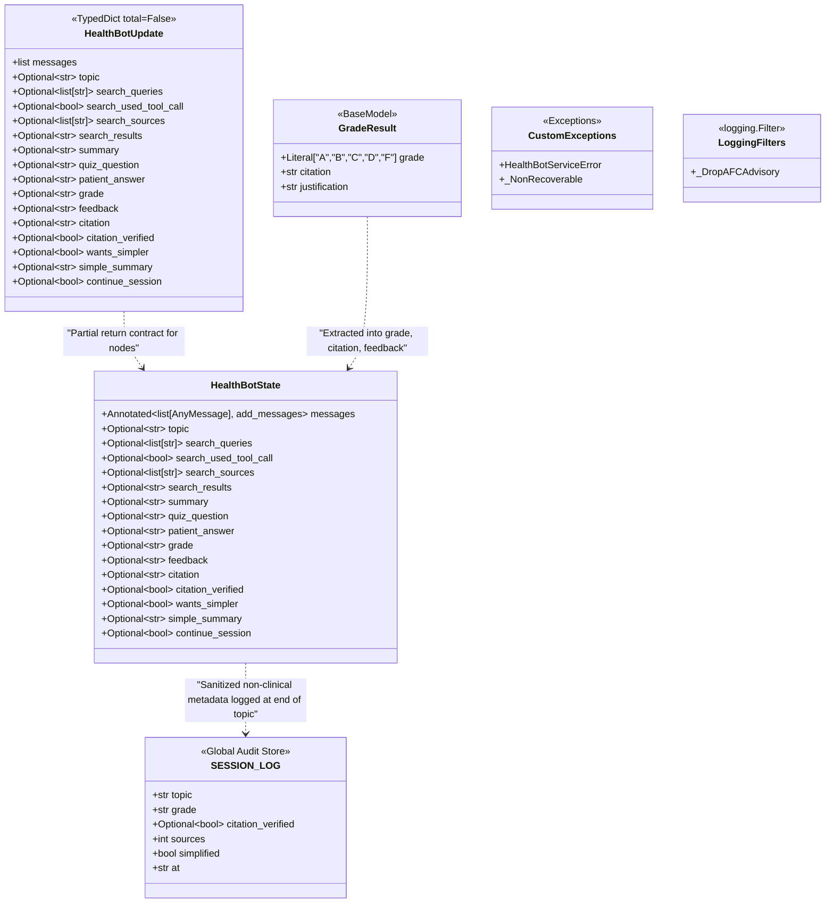

# HealthBot Architecture & Component Wiring Diagrams

This document maps all components of [`healthbot.ipynb`](file:///c:/Project/HealthBot-Accen/healthbot.ipynb), including classes, TypedDict schemas, graph nodes, conditional routers, helper functions, and the resilient multi-provider failover engine.

---

## 1. LangGraph Execution Flow & Node Routing

```mermaid
flowchart TD
    START(["START"]) --> ask_topic["ask_topic\n(Collects & validates topic)"]
    ask_topic --> search_topic["search_topic\n(Invokes Tavily via tool-call or fallback)"]
    search_topic --> summarize_results["summarize_results\n(Generates 3-4 paragraph medical summary)"]
    summarize_results --> present_summary["present_summary\n(Displays summary, disclaimer & source URLs)"]
    present_summary --> generate_quiz["generate_quiz\n(Creates open-ended question based only on summary)"]
    generate_quiz --> ask_quiz_question["ask_quiz_question\n(Prompts patient for answer)"]
    ask_quiz_question --> grade_answer["grade_answer\n(Evaluates answer, grades A-F & validates citation)"]
    grade_answer --> present_grade["present_grade\n(Displays grade, feedback & citation badge)"]

    %% Conditional Routing After Grade
    present_grade --> route_after_grade{"route_after_grade\nIs grade D or F?"}
    route_after_grade -- "Yes (D or F)" --> offer_recap["offer_recap\n(Offers simpler re-explanation)"]
    route_after_grade -- "No (A, B, C)" --> record_progress["record_progress\n(Logs non-clinical topic metadata)"]

    %% Conditional Routing After Recap Offer
    offer_recap --> route_recap{"route_recap\nPatient accepted simpler recap?"}
    route_recap -- "Yes" --> simplify_summary["simplify_summary\n(Generates 2-paragraph plain language explanation)"]
    route_recap -- "No" --> record_progress

    simplify_summary --> present_simple_summary["present_simple_summary\n(Displays simplified explanation)"]
    present_simple_summary --> record_progress

    %% Session Continuation & Cyclic Loop
    record_progress --> ask_continue["ask_continue\n(Asks if patient wants another topic)"]
    ask_continue --> route_continue{"route_continue\nPatient wants to continue?"}
    route_continue -- "Yes" --> reset_state["reset_state\n(Purges messages, clears topic keys, resets failover)"]
    route_continue -- "No" --> END(["END\n(Render session recap & exit)"])

    %% Loopback edge
    reset_state --> ask_topic

    %% Styling
    classDef nodeStyle fill:#1e293b,stroke:#38bdf8,stroke-width:2px,color:#f8fafc;
    classDef routerStyle fill:#312e81,stroke:#818cf8,stroke-width:2px,color:#f8fafc;
    classDef terminalStyle fill:#0f172a,stroke:#22c55e,stroke-width:2px,color:#f8fafc;
    class ask_topic,search_topic,summarize_results,present_summary,generate_quiz,ask_quiz_question,grade_answer,present_grade,offer_recap,simplify_summary,present_simple_summary,record_progress,ask_continue,reset_state nodeStyle;
    class route_after_grade,route_recap,route_continue routerStyle;
    class START,END terminalStyle;
```

---

## 2. State, Schema & Data Class Relationships

---

## 3. Function Call Hierarchy & Invocation / Failover Engine

```mermaid
flowchart TD
    subgraph Setup_and_Init ["1. Setup & Factory"]
        load_dotenv["load_dotenv('.env')"]
        select_model["select_model()"]
        build_chat_model["build_chat_model(provider, model)"]
        ignores_sampling["ignores_sampling_settings(provider, model)"]

        select_model --> build_chat_model
        build_chat_model --> ignores_sampling
    end

    subgraph Resilient_Engine ["2. Resilient LLM & Failover Engine"]
        invoke_model["invoke_model(payload, what, with_tools, schema)"]
        _get_model["_get_model(key, with_tools, schema)"]
        _attempt["_attempt(model, payload, what, label)"]
        redact["redact(text)"]
        _matches["_matches(error, markers)"]
        _retry_hint["_retry_hint_seconds(errors)"]

        invoke_model --> _get_model
        _get_model --> build_chat_model
        invoke_model --> _attempt
        _attempt --> _matches
        _attempt -- "Transient error (429/timeout)" --> _attempt
        _attempt -- "Switch error (Quota/401/404)" --> invoke_model
        invoke_model -- "All providers exhausted" --> _retry_hint
        invoke_model --> redact
    end

    subgraph Payload_Preparation ["3. Prompt & Payload Construction"]
        build_model_payload["build_model_payload(sys_prompt, state, user_prompt, include_search)"]
        _merge_consecutive["_merge_consecutive(messages)"]
        _is_plain_text["_is_plain_text(message)"]
        message_text["message_text(message)"]

        build_model_payload --> _merge_consecutive
        _merge_consecutive --> _is_plain_text
    end

    subgraph Tool_Calling ["4. Tavily Search Subsystem"]
        invoke_tool["invoke_tool(tool, query)"]
        format_search["format_search_results(results)"]
        search_usable["search_looks_usable(text, sources)"]
        describe_search["describe_search(ai_msg, queries, used_tool)"]

        invoke_tool --> search_usable
    end

    subgraph Grading_Subsystem ["5. Answer Grading & Grounding Verification"]
        grade_answer_func["grade_answer(state)"]
        citation_grounded["citation_is_grounded(citation, summary)"]
        normalise_quote["_normalise_quote(text)"]
        parse_grade["parse_grade_response(text)"]
        strip_fence["_strip_code_fence(text)"]

        grade_answer_func --> citation_grounded
        citation_grounded --> normalise_quote
        grade_answer_func -- "Schema fallback" --> parse_grade
        parse_grade --> strip_fence
    end

    subgraph UI_Presentation ["6. Patient-Facing Display Layer"]
        render_markdown["render_markdown(text)"]
        _in_notebook["_in_notebook()"]
        _to_plain_text["_to_plain_text(text)"]
        ask_yes_no["ask_yes_no(question)"]

        render_markdown --> _in_notebook
        render_markdown --> _to_plain_text
    end

    %% Cross-subsystem connections
    search_topic_node["Node: search_topic"] --> invoke_model
    search_topic_node --> invoke_tool
    search_topic_node --> format_search
    search_topic_node --> describe_search

    summarize_node["Node: summarize_results"] --> build_model_payload
    summarize_node --> invoke_model
    summarize_node --> message_text

    generate_quiz_node["Node: generate_quiz"] --> build_model_payload
    generate_quiz_node --> invoke_model
    generate_quiz_node --> message_text

    grade_answer_node["Node: grade_answer"] --> grade_answer_func
    grade_answer_func --> invoke_model

    simplify_node["Node: simplify_summary"] --> build_model_payload
    simplify_node --> invoke_model
    simplify_node --> message_text
```

---

## 4. Node-to-State Dataflow Matrix

```mermaid
flowchart LR
    subgraph Inputs ["State Read (Inputs)"]
        R_Topic["state['topic']"]
        R_Search["state['search_results']"]
        R_Sources["state['search_sources']"]
        R_Summary["state['summary']"]
        R_Question["state['quiz_question']"]
        R_Answer["state['patient_answer']"]
        R_Grade["state['grade']"]
        R_Citation["state['citation']"]
        R_CitationVer["state['citation_verified']"]
        R_WantsSimpler["state['wants_simpler']"]
        R_SimpleSummary["state['simple_summary']"]
        R_Continue["state['continue_session']"]
        R_Messages["state['messages']"]
    end

    subgraph Nodes ["LangGraph Nodes"]
        N_ask_topic["ask_topic"]
        N_search_topic["search_topic"]
        N_summarize["summarize_results"]
        N_present_summary["present_summary"]
        N_generate_quiz["generate_quiz"]
        N_ask_quiz["ask_quiz_question"]
        N_grade["grade_answer"]
        N_present_grade["present_grade"]
        N_offer_recap["offer_recap"]
        N_simplify["simplify_summary"]
        N_present_simple["present_simple_summary"]
        N_record["record_progress"]
        N_ask_continue["ask_continue"]
        N_reset["reset_state"]
    end

    subgraph Outputs ["State Write (Updates)"]
        W_Topic["topic"]
        W_SearchQueries["search_queries"]
        W_SearchTool["search_used_tool_call"]
        W_SearchSources["search_sources"]
        W_SearchResults["search_results"]
        W_Summary["summary"]
        W_QuizQuestion["quiz_question"]
        W_PatientAnswer["patient_answer"]
        W_Grade["grade"]
        W_Feedback["feedback"]
        W_Citation["citation"]
        W_CitationVer["citation_verified"]
        W_WantsSimpler["wants_simpler"]
        W_SimpleSummary["simple_summary"]
        W_Continue["continue_session"]
        W_Messages["messages"]
        W_RemoveMessages["RemoveMessage(all)"]
    end

    %% Connections for ask_topic
    N_ask_topic --> W_Topic
    N_ask_topic --> W_Messages

    %% Connections for search_topic
    R_Topic --> N_search_topic
    N_search_topic --> W_SearchQueries
    N_search_topic --> W_SearchTool
    N_search_topic --> W_SearchSources
    N_search_topic --> W_SearchResults
    N_search_topic --> W_Messages

    %% Connections for summarize_results
    R_Topic --> N_summarize
    R_Search --> N_summarize
    N_summarize --> W_Summary
    N_summarize --> W_Messages

    %% Connections for present_summary
    R_Topic --> N_present_summary
    R_Summary --> N_present_summary
    R_Sources --> N_present_summary

    %% Connections for generate_quiz
    R_Summary --> N_generate_quiz
    N_generate_quiz --> W_QuizQuestion
    N_generate_quiz --> W_Messages

    %% Connections for ask_quiz_question
    R_Question --> N_ask_quiz
    N_ask_quiz --> W_PatientAnswer
    N_ask_quiz --> W_Messages

    %% Connections for grade_answer
    R_Summary --> N_grade
    R_Question --> N_grade
    R_Answer --> N_grade
    N_grade --> W_Grade
    N_grade --> W_Feedback
    N_grade --> W_Citation
    N_grade --> W_CitationVer
    N_grade --> W_Messages

    %% Connections for present_grade
    R_Grade --> N_present_grade
    R_Citation --> N_present_grade
    R_CitationVer --> N_present_grade

    %% Connections for offer_recap
    N_offer_recap --> W_WantsSimpler

    %% Connections for simplify_summary
    R_Summary --> N_simplify
    R_Question --> N_simplify
    R_Answer --> N_simplify
    R_Citation --> N_simplify
    N_simplify --> W_SimpleSummary
    N_simplify --> W_Messages

    %% Connections for present_simple_summary
    R_SimpleSummary --> N_present_simple

    %% Connections for record_progress
    R_Topic --> N_record
    R_Grade --> N_record
    R_Sources --> N_record
    R_CitationVer --> N_record
    R_SimpleSummary --> N_record

    %% Connections for ask_continue
    N_ask_continue --> W_Continue

    %% Connections for reset_state
    R_Messages --> N_reset
    N_reset --> W_RemoveMessages
```

